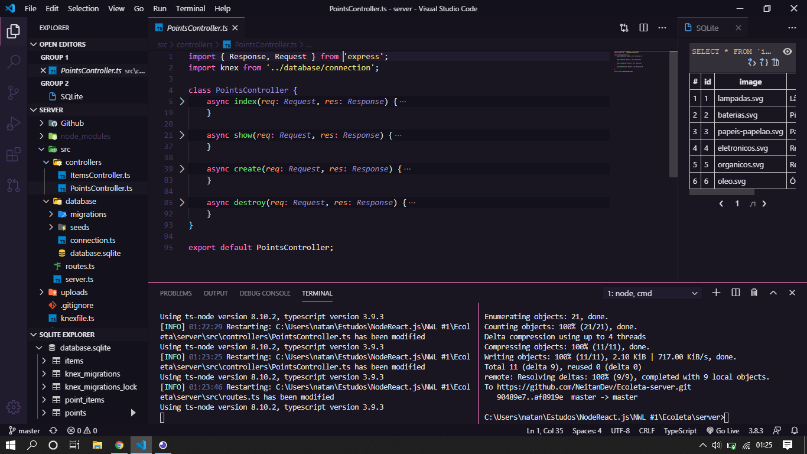

<h1 align="center">
    
</h1>

<h4 align="center">
  🚀 Ecoleta
</h4>

  <a href="#rocket-tecnologias">Tecnologias</a>&nbsp;&nbsp;&nbsp;|&nbsp;&nbsp;&nbsp;
  <a href="#-projeto">Projeto</a>&nbsp;&nbsp;&nbsp;|&nbsp;&nbsp;&nbsp;
  <a href="#-contato">Contato</a>

 

  

## :rocket: Tecnologias

Esse projeto foi desenvolvido utilizando:

- [Node.js](https://nodejs.org/en/)
- [Express](https://expressjs.com/pt-br/)
- [Knex.js](https://knexjs.org/)
- [SQLite](https://www.sqlite.org/index.html)

## 💻 Projeto

É um projeto onde será possivel visualizar os pontos de coleta de lixo reciclavel

## 📧 Contato

- Email: natan.miranda02@gmail.com
- [Linkdin](https://www.linkedin.com/in/natan-bezerra-de-miranda-0b4b93180/)
- [Instagram](https://www.instagram.com/neitan_miranda02/)

---

Feito com ♥ by Natan Bezerra de Miranda :wave: